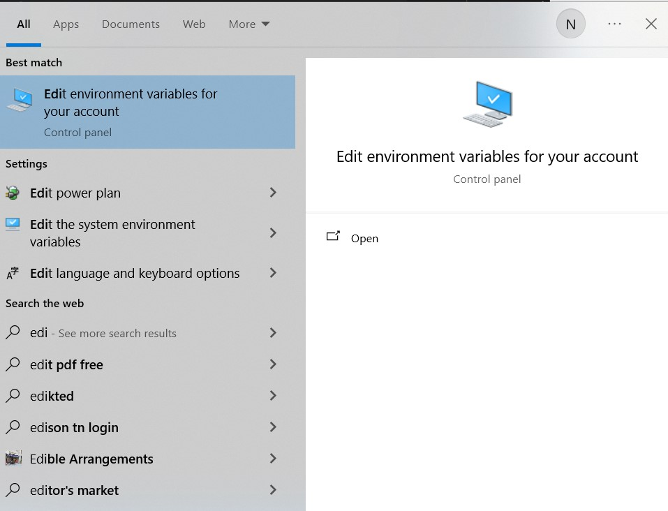
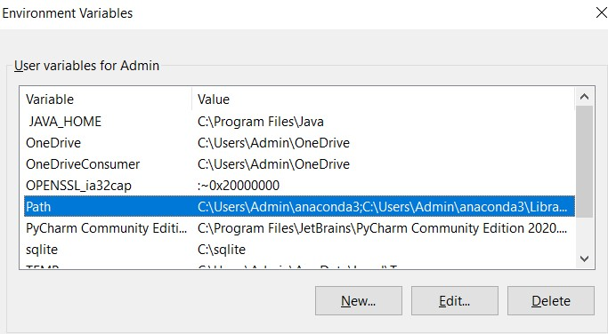
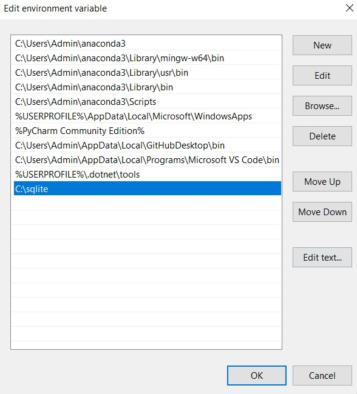

# Pokemon Auction App

This app was created for module IS631 Modern Software Solution. This app is similar to Carousell, serving as a online solution for buying/selling cards. Our innovation is through the use of a PSA grader to pre-grade the cards to ensure that cards being sold are genuine, and the buyer does not get scammed.

## Installation
---
### Installing SQLite3

To run the database, we use SQLite3 since it is a simple database for the webapp for now. In the future, we can run database on cloud sources.

1. Go to the [SQLite3 Download Page](https://www.sqlite.org/download.html) and download the correct version of SQLite3 depending on your computer's version
2. Extract out all packages and add them to the folder in ```C:\User\YOUR_USERNAME```
3. Add the file to the environment variables
    3.1 Go to Start Bar and type ```Edit environment variables for your account``` 
    3.2 Go to user variables, and then click on ```Path``` 
    3.3 Add a new path for SQLite so that you can run it on your current user 
    3.4 Press Ok to close all environment variables path.

To verify the proper installation of SQLite3, close all open command prompts / terminals and run the following command

```
sqlite3
```

You should see SQLite3 command line.

### Install Python Packages
Below are the packages required for Python. If you need anymore, please add them to this list.

```
pip install uvicorn 
pip install fastapi 
pip install python-multipart
```